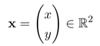
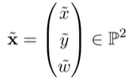
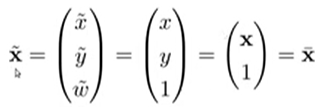
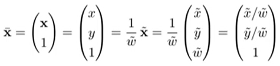
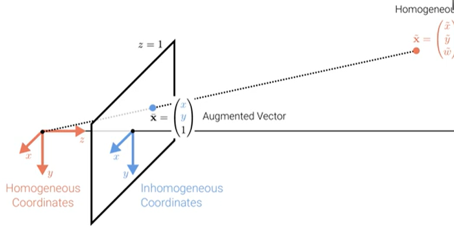
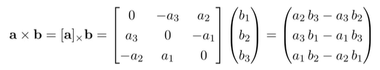

- Geometric primitives are the basic building blocks used to describe 3D shapes.

## 2D points

2D points can be written in inhomogeneous coordinates as :

or in homogeneous coordinates as:

where $$\mathcal{P}^2 = \mathcal{R}^3 \ \{(0, 0, 0)\}$$ is called projective space.

Homogeneous vectors that differ only by scale are considered equivalent and define an equivalence class. Homogeneous vectors are defined only up to scale.

An inhomogeneous vector x is converted to a homogeneous vector x as follows:

with augmented vector $$\bar{x}$$. To convert in the opposite direction we divide by $$\tilde{w}$$:

Homogeneous points whose last element is $$\tilde{w} = 0$$ are called ideal points or points at infinity. These points can't be represented with inhomogeneous coordinates.

2D lines can also be expressed using homogeneous coordinates $$\mathcal{I} = (a, b, c)^T$$:

$$\{\bar{x} | \tilde{I}^T\bar{x} = 0\} <-> \{x, y | ax + by + c = 0\}$$

We can normalize $$\textbf{\tilde{I}}$$ so that $$\tilde{I} = (n_x, n_y, d)^T = (\textbf{n}, d)^T$$ with $$||n||_2 = 1$$. In this case, **n** is the normal vector perpendicular to the line and d is the distance to the origin.

An exception is the line at infinity $$\tilde{I_{\inf}} = (0, 0, 1)^T$$ which passes through all ideal points.

## Cross Product

Cross product expressed as the product of a skew-symmetric matrix and a vector 

## 2D Line Arithmetic

In homogeneous coordinates, the intersection of two lines is given by:

$$\tilde{x} = \tilde{I}_1 x \tilde{I}_2$$