## Origins of Pinhole Camera

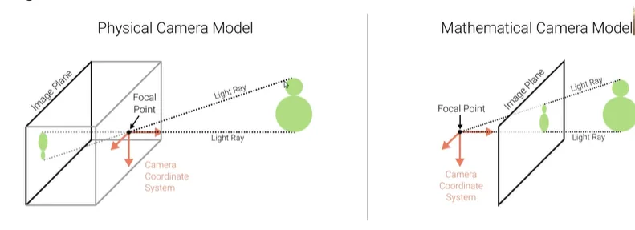

- In a physical pinhole camera the image is project up-side down onto the image plane which is located behind the focal point.
- When modeling perspective projection, we assume the image plane in front.
- Both models are equivalent, with appropriate change of image coordinates.

## Projection Models

1. Orthographic Projection:

Light is assumed to travel parallel to each other's ray

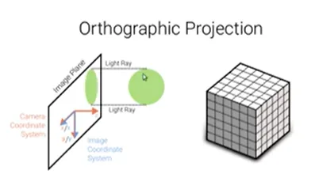

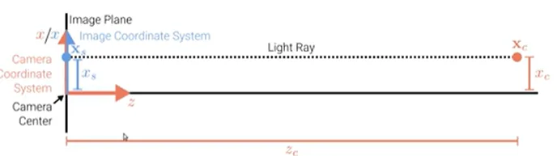 $$x_s = x_c$$

Orthographic projection of a 3D point $$x_c \in \mathcal{R}^3$$ to pixel coordinates $$x_s \in \mathcal{R}^2$$:
- The x and y axes of the camera and image coordinate systems are shared.
- Light rays are parallel to the z-coordinate of the camera coordinate system.
- During projection, the z-coordinate is dropped, x and y remain the same.
- Y coordinate behaves similarly

An orthographic projection simply drops the z component of the 3D point in camera coordinates $$x_c$$ to obtain the corresponding 2D point on the image plane $$x_s$$.

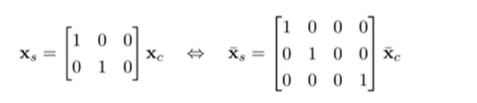

Orthography is exact for telecentric lenses and an approximation for telephoto lenses, After projection the distance of the 3D point from the image can't be recovered.

## Scaled Orthographic Projection

In practice, world coordinates (which may measure dimensions in meters) must be scaled to fit onto an image sensor (measuring in pixels) => scaled orthography.

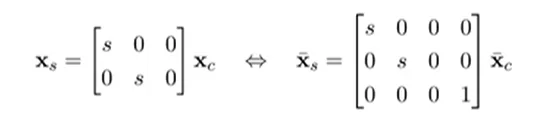

The unit for s is px/m or px/mm to convert metric 3D points into pixels

Under orthography, structure and motion can be estimated simultaneously using factorization methods (e.g. via singular value decomposition).

2. Perspective Projection:

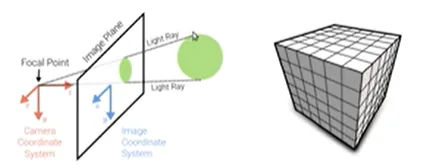

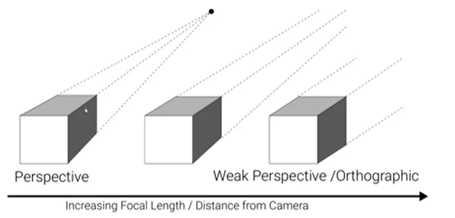

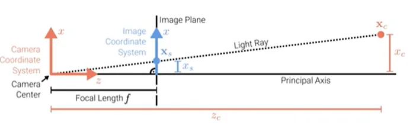 $$\frac{x_s}{f} = \frac{x_c}{z_c}$$

Perspective projection of a 3D point $$x_c \in \mathcal{R}^3$$ to pixel coordinates $$x_s \in \mathcal{R}^2$$
- The light ray passes through the camera center, the pixel $$x_s$$ and the point $$x_c$$
- Convention: The principal axis (orthogonal to image plane) aligns with the z-axis

In perspective projection, 3D points in camera coordinates are mapped to the image plane by dividing them by their z component and multiplying with the focal length:

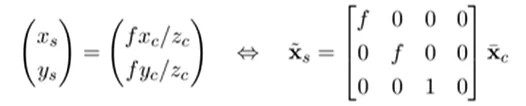

This projection is linear when using homogeneous coordinates. After the projection, it is not possible to recover the distance of the 3D point from the image

The unit of f is px (pixels) to convert metric 3D points into pixels.

- To ensure positive pixel coordinates, a principal point offset c is usually added.
- This moves the image coordinate system to the corner of the image plane.

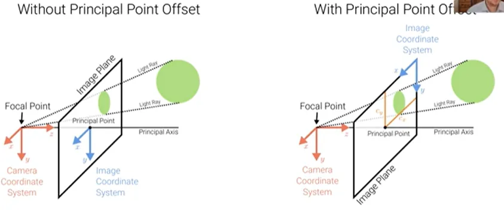

The complete perspective projection model is given by:

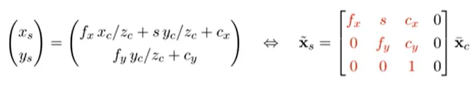

- The left 3 X 3 submatrix of the projection matrix is called the calibration matrix K.
- The parameters of K are called camera intrinsics (as opposed to extrinsic pose)
- Here fx and fy are independent, allowing for different pixel aspect ratios.
- The skew s arises due to the sensor not mounted perpendiculr to the optical axis
- In practice, we often set fx = fy and s = 0, but model c = (cx, cy)^T

## Chaining Transformations

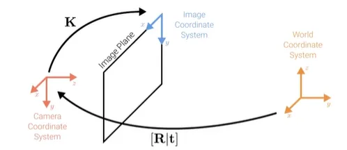

Let K be the calibration matrix (intrinsics) and $$[R | t]$$ the camera pose (extrinsics)

We chain both transformations to project a point in world coordinates to the image:

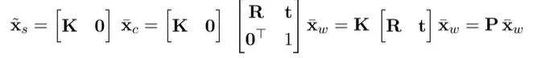

The 3 X 4 projection matrix P can be pre-computed.

## Full Rank Representation

It is sometimes preferable to use a full rank 4 x 4 projection matrix:

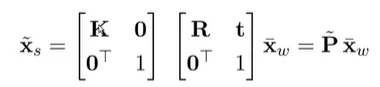

Now, the homogeneous vector $$\tilde{x_s}$$ is a 4D vector and must be normalized wrt its 3rd entry to obtain inhomogeneous image pixels:

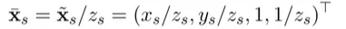

The 4th component of the inhomogeneous 4D vector is the inverse depth. If the inverse depth is known, a 3D point can be retrieved from its pixel coordinates via $$\tilde{x}_w = \textbf{\tilde{P}^{-1}}\bar{x}_s$$ and the subsequent normalization of $$\tilde{x}_w$$ wrt its 4th entry

## Lens Distortion

- The assumption of linear projection (straight lines remain straight) is violated in practice due to the properties of the camera lens which introduces distortions.

- Both radial and tangential distortion effects can be modeled relatively easily:

Let $$x = \frac{x_c}{z_c}, y = \frac{y_c}{z_c}$$ and $$r^2 = x^2 + y^2$$

The distorted point is obtained as:

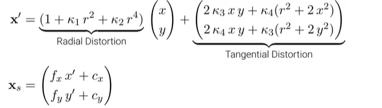

Images can be undistorted such that the perspective projection model applies. More complex distortion models must be used for wide-angle lenses.

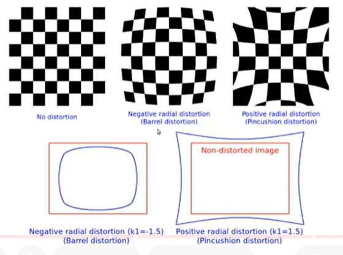