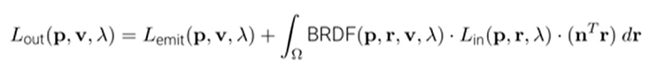
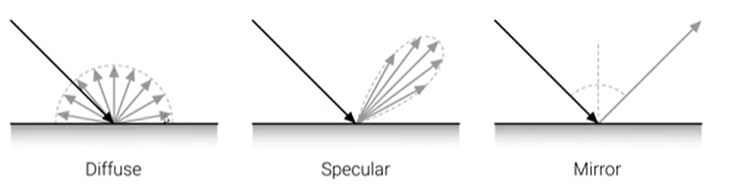
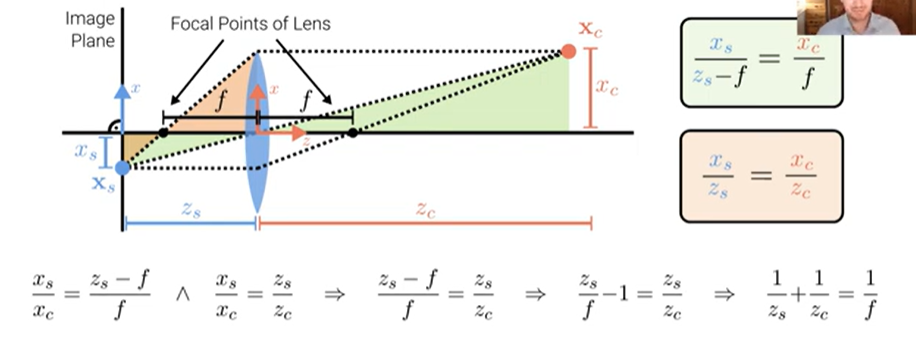
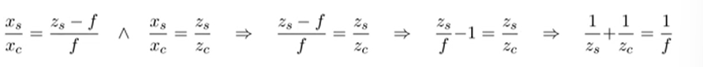
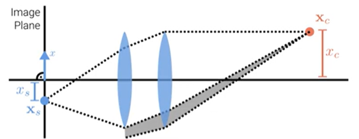

## Photometric Imahe formation

- Light is emitted by one or more light sources and reflected or refracted (once or multiple times) at surfaces of objects (or media) in the scene

## Rendering Equation

Let $$\textbf{p} \in \mathcal{R}^3$$ denote a 3D surface point, $$\textbf{v} \in \mathcal{R}^3$$ the viewing direction and $$\mathcal{r} \in \mathcal{R}^3$$ the incoming light direction.

The rendering equation describes how much of the light $$L_{in}$$ with wavelength $$\lambda$$ arriving at p is reflected into the viewing direction v: 

- $$\omega$$ is the unit hemisphere at normal n
= The bidirectional reflectance distribution function BRDF(p, r, v, $$\lambda$$) defines how light is reflected at an opaque surface.
- $$L_{emit} > 0$$ only for light emitting surfaces.

## Diffuse and Specular Reflection

- Typical BRDFs have a diffuse and speculr component
- The diffuse (=constant) component scatters light uniformly in all directions.
- This leads to shading, i.e. smooth variation of intensity wrt. surface normal
- The specular component depends strongly as the outgoing light direction.

- BRDFs can be very complex and spatially varying

## Fresnel Effect

- The amount of light reflected from a surface depends on the viewing angle.

## Global Illumination

- Modeling one light is bounce is insufficient for rendering complex scenes.
- Light sources can be shadowed by occluders and rays can bounce multiple times.
- Global illumination techniques also take indirect illumination into account.

## Why camera lenses:

- Large and very small pinholes result in image blur (averaging, diffraction).
- Small pinholes require very long shutter times (motion blur)

## Optics

- Cameras use one or multiple lenses to accumulate light on the sensor plane.
- Importantly, if a 3D point is in focus, all light rays arrive at the same 2D pixel
- For many applications is suffices to model lens cameras with a pinhole model.
- However to address focus, vignetting and aberration we need to model lenses.

## Thin Lens Model

- The thin lens model with spherical lens is often used as an approximation
- Properties: Axis-parallel rays pass the focal point, rays via center keep direction
- From snell's law we obtain $$f = \frac{R}{2(n - 1)}$$ with radius R and index of refraction n

## Depth of Field

- The image is in focus if $$\frac{1}{z_s} + \frac{1}{z_c} = \frac{1}{f}$$ where f is the focal length of the lens.

- For $$z_c -> \inf$$ we obtain zs = f (lens with focal length f $$\approx$$ pinhole at distance f)

- If the image plane is out of focus, a 3D point projects to the circle of confusion c.

- To control the size of the circle of confusion, we change the lens aperture

- The aperture is a hole or an opening through which light travels

- The aperture limits the amount of light that can reach the image plane.

- Smaller apertures lead to sharper, but more noisy images (less photons).

- The allowable depth variation that limits the circle of confusion c is called depth of field and is a function of both the focus distance and the lens aperture.

- Typical DSLR lenses have depth of field indicators.

- The commonly displayed f-number is defined as $$N = \frac{f}{d}$$

- It is the focal length f divided by the aperture diameter d

- It is the distance between the nearest and farthest objects that are acceptably sharp.

- Decreasing the aperture diameter (increasing the f-number) increases the DOF.

## Chromatic Aberration

- The index of refraction for glass varies slightly as a function of wavelength.
- Thus, simple lenses suffer from chromatic aberration which is the tendency for light of different colors to focus at slightly different distances (blur, color shift)
- To reduce chromatic, and other kinds of aberrations, most photographic lenses are compound lenses made of different glass elements (with different coatings).

## Vignetting

- The tendency for the brightness to fall off towards the image edge.
- Composition of two effects: natural and mechanical vignetting
- Natural vignetting: foreshortening of object surface and lens aperture.
- Mechanical vignetting: The shaded part of the beam never reaches the image.
- Vignetting can be calibrated (i.e. undone)