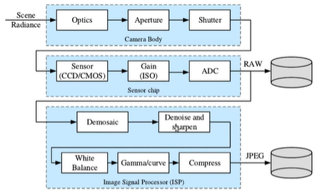
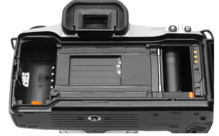
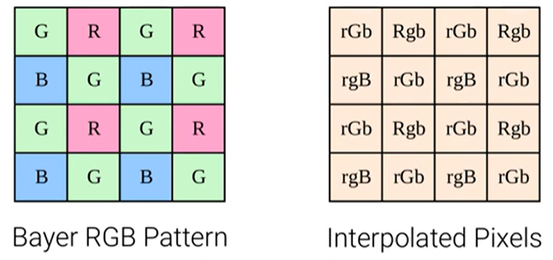
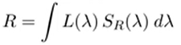
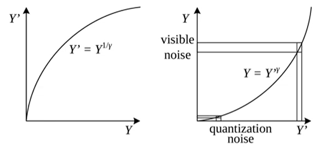

The image sensing pipeline can be divided into three stages:
- Physical light transport in the camera lens/body.
- Photon measurement and conversion on the sensor chip
- Image signal processing (ISP) and image compression.

## Shutter

- A focal plane shutter is positioned just in front of the image sensor/film
- Most digital cameras use a combination of mechanical and electronic shutter.
- The shutter speed (exposure time) controls how much light reaches the sensor.
- It determines if an image appears over-/underexposed, blurred or noisy.

## Sensor
- CCDs move charge from pixel to pixel and convert it to voltage at the output node.
- CMOS images convert charge to voltage inside each pixel and are standard.
- Larger chips (full frame=35mm) are more photo sensitive => less noise.

## Color Filter Arrays

- To measure color, pixels are arranged in a color array
- Missing colors at each pixel are interpolated from neighbors (demosaicing).

- Each pixel integrates the light spectrum L according to its spectral sensitivity S:

- The spectral response curves are provided by the camera manufacturer.

## Gamma Compression

- Humans are more sensitive to intensity differences in darker regions.
- Therefore, it is beneficial to nonlinearly transform (left) the intensities or colors prior to discretization (left) and to undo this transformation during loading.

## Image Compression

- Typically luminance is compressed with higher fidelity than chrominance.
- Often, patch-based discrete cosine or wavelet transforms are used.
- Discrete Cosine Transform (DCT) is an approximation to PCA on natural images.
- The coefficients are quantized to integers that can be stored with Huffman codes.