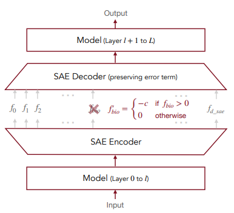

# Applying Sparse Autoencoders To Unlearn Knowledge In Language Models

This post describes my learnings and notes from reading the Paper by Eoin Farrell, Yeu-Tong Lau and Arthur Conmy.

## Introduction

Large Language Models often learn knowledge we don't want them to retain, ranging from harmful misinformation to sensitive capabilities. Fine tuning can be used to align the model to not talk about topics based on causing harms, danger, etc. but it's hard to tell what exactly happens when a model is fine tuned that way. This paper explores whether Sparse Autoencoders (SAEs) can help us make models "forget" in a more interpretable way. The authors test this idea on the biosecurity subset of the Weapons of Mass Destruction Proxy data using Google's Gemma models. Findings show that while SAEs can target and suppress specific biological knoweledge, current methods still cause notable side effects - highlighting both the promise and limitations of interpretable learning.

Sparse Autoencoders use an unsupervised method to learn sparse reconstruction of language model activations. SAEs have been shown to find interpretable features in language models.

## Methodology

(1) Examine how SAE quality and width impact unlearning effectiveness. Wider SAEs with specific features may improve performance. 
(2) Compare SAE-based unlearning to activation steering using bio-related and non-bio-related prompt pairs. 
(3) Investigate how SAE interventions affect related features in subsequent layers to better understand the unlearning mechanism.