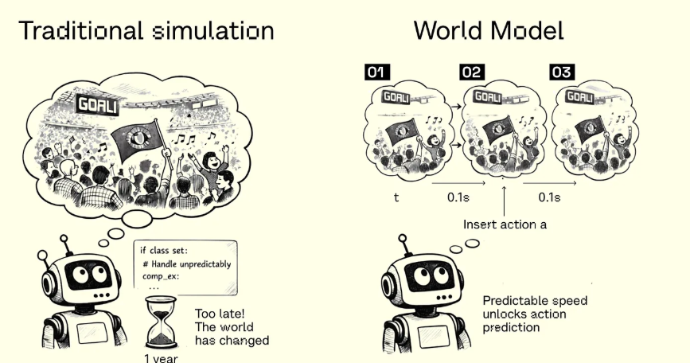

In this blog post, I will talk about world models which are the buzz of the current days, we are hearing a lot about them from small startups to large companies like Nvidia and Google. In this post, we will talk about Dreamer V1 by Danijar Hafner and team at Google Deepmind which was developed by the team in 2020 and the paper was accepted at ICLR 2020. There will be a series of blog posts from Dreamer V1 to Dreamer V4 and their evolution. In each post we will also discuss how we can implement Dreamer V1 from scratch in Pytorch as well as TorchWM which is a modular pytorch based library I have been working on for the past few months to make world models research faster, easier and more enjoyable.

So before diving deep into Dreamer V1 we will first take a look at what are world models. 

## What are World Models ?

World models are internal representations that an AI system builds to understand how the world works and predict what will happen next. It's like simulating a bunch of scenarios and outcomes before the stepping into the reality. 

Let's say you are going to go for a driving lesson tomorrow and you are going to touch the steering wheel of the car for the first time in your life, it will be your first day and you are a bit anxious and you start imagining, what if I got lost while driving and bumped into another car on the road ? How can I concentrate on my driving and change gears at the same time ? Will I do it right ? you start imagining all these scenarios and think of how you will react in each of those situations, similar is the case for world model.

A world model form an internal representation of the actual world and simulates a lot of different scenarios and how it might react to it in each case tries to learn a optimial policy in the simulated environment and then applies those policies to the real world.

## Why are World Models useful ?

Intelligent agents navigate complex, ever-changing environments by building internal models of how the world works, not by memorizing situations, but by learning structure that transfers. World models make this explicit: they encode an agent's knowledge into a learnable, parametric form that can simulate what happens next, enabling the agent to reason and plan beyond what it has directly experienced.

## How world models learn ? 

As we discussed previously, world models learn an internal representation of the world, this internal representation is also known as latent representation, latent representations are something we don't observe but are present during the learning phase.

World modeling can also be thought of as model-based reinforcement learning. The outside world is a POMDP (Partially Observable Markov Decision Process), the agent never sees the full state of the world, only partial, noisy observations like pixels or sensor readings.

World Models predict the next state given the present state and action.

### The Core Objective

At the heart of it, a world model is trying to answer one question:

Given what I've seen and done so far, what happens next?

This means the model must learn to predict: future observations, rewards, and how the world changes in response to actions. Prediction is the training signal. The model gets better at representing the world precisely because being wrong about the future is penalized.
This is a powerful idea: you don't need hand-labeled data. The world itself provides supervision, one timestep at a time.

