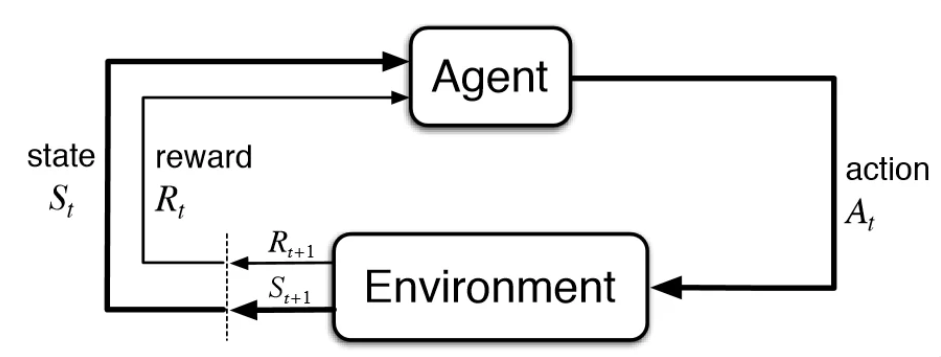
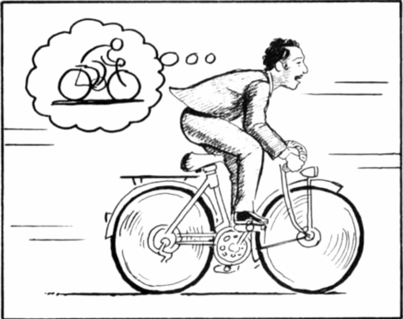

In this blog post, Let's talk about Dreamer V1, accepted in 2020 at ICLR. This model is special because it came with a really cool idea, what if we could train an agent inside it's own dreams ? Sounds cool, right ? At the same time, it makes us think, how is that even possible ?

The agent, Dreamer, learned almost entirely without touching the environment. It built a model of the world from raw image observations, retreated into that model, imagined thousands of possible futures, and trained itself on those imagined experiences. Then it would briefly step into the real environment, collect a little fresh data, and return to dreaming.

This loop turned out to be extraordinarily efficient. Dreamer hit a higher average score than D4PG, the strongest model-free agent of its era, using 20 times fewer environment steps. 

Dreamer builds a world model first and then trains an agent inside that world model, what is a world model ? a model which builds an internal representation of how the world works so it can predict outcomes, reason about situations and plan actions. As the authors of this blog (Not Boring, 2020) put it “I wanted to fall asleep last night. Instead, I started imagining all of the scenarios I might run into the next day, and how I might react to them.”

This is the first chapter in a four-part series covering Dreamer V1 through V4. Each version fixes a clear failure mode of the one before it, and by the end the architecture looks less like a narrow RL system an more like a general-purpose world model. But it all starts here.
## The Problem with Learning By Doing
Imagine you're trying to teach a robot to walk. The naive approach is to let it try, fall over, get up, try again, thousands of times, until it figures out how to stay upright. This is essentially what model-free reinforcement learning does, and for simple tasks in simulation it works fine. But the moment you push into anything remotely complex, the cracks show fast.

The numbers are sobering. D4PG (Barth-Maron et al., 2018) one of the strongest model-free agents of its era, needs roughly 100 million environment steps to reach good performance on the Deepmind Control Suite (Tassa et al., 2018). At 30 frames per second of simulated interaction, that's over 37 hours of continuous experience and that's in a fast physics simulator where you can run thousands of parallel instances. In the real world, where a robot arm can only move so fast and a failed grasp means resetting a physical setup, 100 million steps is simply not achievable.

Every gradient update requires real interactions. You cannot reason about what would have happened if you'd taken a different action. You only learn from paths you actually walked down. The agent has no internal model of how the world works, so it can't simulate alternatives, can't plan ahead, can't generalize from one situation to an adjacent one it hasn't visited yet. It just collects experience and fits a value function to it, one step at a time.

World models are the computation attempt to give agents the capacity to reason about consequences before commiting to them. The idea is to learn a parametric model of the environment, one that can predict what will happen next given any action and then use that model to plan or learn behaviors without executing them in the real world. If the model is good enough, the agent can explore and learn almost entirely in imagination, touching the real environment only occasionally to keep the model grounded.

Building reliable world models is hard. Early approaches like Dyna (Sutton, 1991) didn't extend to high-dimensional image inputs. World Models (Ha & Schmidhuber, 2018), showed you could learn compact latent representations of visual environments, but derived behaviors through evolution strategies: slow, derivative-free, and hard to scale. PlaNet learned latent dynamics jointly and planned through them at test time, but online planning is expensive and shortsighted at short horizons (Hafner et al., 2019).

The gap going into 2020 was specific: nobody had successfully backpropagated analytic gradients through multi-step imagined trajectories at scale on image-based tasks. You could learn a world model. You could plan through it approximately. But training a policy by differentiating through the model's own predictions treating the imagined future as a computation graph hadn't been made to work cleanly.

That's the gap Dreamer closed. Just 5 million environment steps is all it needs to exceed D4PG's 100 million-step performance a 20× reduction, achieved almost entirely by learning in a compact latent space the agent built for itself.
## The Dreamer Loop: Three Phases, One Lifetime

Dreamer is organized around three interleaved operations that run throughout the agent's lifetime: dynamics learning, behavior learning and environment interaction.

### Phase 1: Dynamics Learning

The first phase takes raw experience from a dataset D and compresses it into a latent world model. The world model consists of three components trained jointly:

1. Representation Model : $$ p_{\theta}(s_t | s_{t - 1}, a_{t - 1}, o_t) $$ encodes the current image observation $$o_t$$ along with the previous latent state and action into a compact continuous vector $$s_t$$. This is the "perception" module: it maps high dimensional pixels into a Markovian space.

2. Transition Model: $$q_{\theta}(s_t | s_{t - 1}, a_{t - 1})$$, predicts the next latent state without looking at the observation. This is the model's ability to "imagine forward" in latent space given only actions. The gap between the representation model (which sees the image) and the transition model (which doesn't) is precisely the KL regularizer in the ELBO, the representation model is trained to be predictable from the transition model's prior.

3. Reward Model: $$q_{\theta}(r_t | s_t)$$ maps latent states to scalar rewards. This is what makes the latent space meaningful for control. The geometry of the latent space must encode enough information to predict rewards.

These three components are trained jointly by maximizing the variational lower bound (ELBO):

$$ \mathcal{J}_{REC} = \mathcal{E}_p \sum_t [\ln q(o_t | s_t) + \ln q(r_t | s_t) - \beta KL[p(s_t | s_{t - 1}, a_{t - 1}, o_t) || q(s_t | s_{t - 1}, a_{t - 1})]] $$

The reconstruction term forces the latent state to be decodable back to images, the reward term forces it to carry task-relevant information, and the KL keeps the posterior close to the transition prior, which is what makes imagination possible in phase 2. The RSSM (Recurrent State Space Model) implements the transition model as a recurrent network, letting it maintain temporal context while still supporting fast parallel rollouts.

The world model parameters $$\theta$$ are frozen during behavior learning. The dynamics learning phase and behavior learning phase are coupled only through the latent states, not through shared gradients which stabilizes training considerably.

### Phase 2: Behaviro Learning
Rather than interacting with the real environment to collect policy gradients, Dreamer rolls out entirely imagined trajectories inside the learned world model and learns actor and critic networks from those.

Starting from real latent states $$s_t$$, computed during dynamics learning, the agent imagines trajectories $$\{ s_{\tau}, a_{\tau}, r_{\tau} \}_{r = t}^{t + H}$$ for an imagination horizon H by repeatedly applying the transition model and sampling actions from the current action model $$q_{\phi}(a_{\tau} | s_{\tau})$$.

The action model outputs a tanh-transformed Gaussian over continuous actions:

$$a_{\tau} = \tanh(\mu_{\phi}(s_{\tau}) + \sigma_{\phi}(s_{\tau})\epsilon), \epsilon \tilde \mathcal{N}(0, \mathcal{I})$$

The tanh-Gaussian parameterization is crucial because it allows reparameterization: sampled actions are differentiable functions of $$\phi$$, so gradients of downstream value predictions can flow back through the sampling step and through multiple imagine transitions all the way to the action model parameters.

## The World Model: Learning to Dream
## The Imagination Environment: A Fully-Observed MDP in Your Head
## Actor-Critic in Latent Space: Learning Without Touching the World
## Value Estimation: Not Being Shortsighted
## Results: Dreamer vs. the World
## What Dreamer Gets Wrong: The Cracks
## The Big Picture: Why Dreamer v1 Mattered

## References

Barth-Maron, G., Hoffman, M. W., Budden, D., Dabney, W., Horgan, D., TB, D., ... & Lillicrap, T. (2018). Distributed distributional deterministic policy gradients. arXiv preprint arXiv:1804.08617.

Ha, D., & Schmidhuber, J. (2018). World models. arXiv preprint arXiv:1803.10122. (Note: This appears to be the arXiv version corresponding to the Zenodo record.)

Hafner, D., Lillicrap, T., Fischer, I., Villegas, R., Ha, D., Lee, H., & Davidson, J. (2019). Learning latent dynamics for planning from pixels. arXiv preprint arXiv:1811.04551.

Not Boring. (2020). World Models. https://www.notboring.co/p/world-models

Sutton, R. S. (1991). Dyna, an integrated architecture for learning, planning, and reacting. ACM SIGART Bulletin, 2(4), 160-163.

Tassa, Y., Doron, Y., Muldal, A., Erez, T., Li, Y., de Las Casas, D., ... & Riedmiller, M. (2018). DeepMind control suite. arXiv preprint arXiv:1801.00690.
